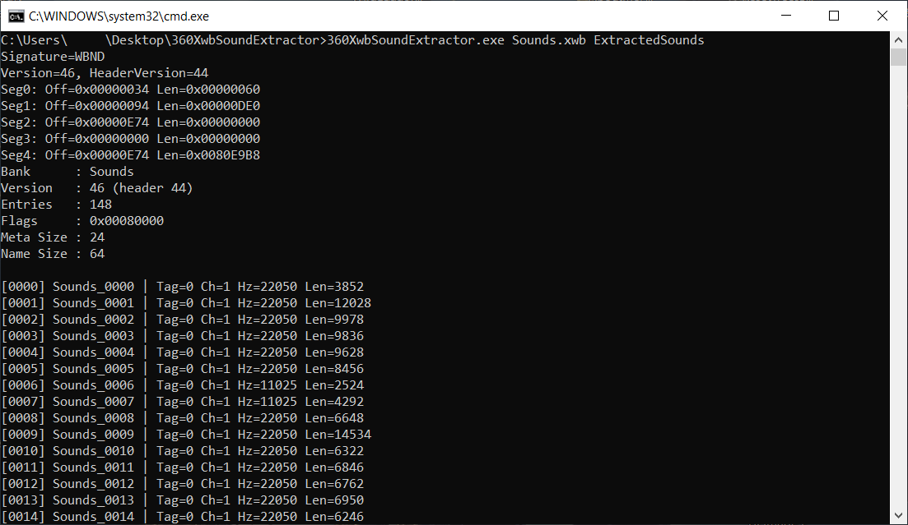

# 360XwbSoundExtractor

A small standalone C# utility for extracting audio entries from standard XACT `.xwb` wave bank files, including Xbox 360-style big-endian wave banks.

This project was created as a preservation/debugging tool for CastleMiner Z-related asset work. It is not required for normal gameplay, mod loading, or texture pack usage.



## Features

- Reads standard XACT wave bank files using either signature:
  - `WBND` — little-endian / standard PC-style XWB
  - `DNBW` — big-endian / Xbox 360-style XWB
- Extracts PCM entries as `.wav` files.
- Extracts Microsoft ADPCM entries as `.wav` files.
- Dumps WMA/xWMA entries as raw `.xwma.bin` payloads with metadata sidecars.
- Dumps XMA entries as raw `.xma.bin` payloads with metadata sidecars.
- Uses embedded entry names when the XWB includes an entry-name segment.
- Falls back to numbered names when entry names are not present.
- Byte-swaps big-endian 16-bit PCM sample data before writing WAV output.

## Limitations

This is intentionally a simple extractor, not a full XACT authoring or conversion suite.

Current limitations:

- Compact wave banks are not supported.
- XMA entries are not decoded to playable WAV audio; they are dumped as raw payloads.
- WMA/xWMA entries are not decoded to playable WAV audio; they are dumped as raw payloads.
- The extractor expects standard 24-byte entry metadata.
- Output quality and compatibility depend on the source bank format.

## Requirements

- Windows
- Visual Studio 2022 or another C# build environment that supports .NET Framework projects
- .NET Framework 4.8.1 Developer Pack for building from source

## Building

Open the solution/project in Visual Studio and build the project normally.

The included project targets:

```text
.NET Framework 4.8.1
AnyCPU
Console Application
```

Expected output:

```text
360XwbSoundExtractor.exe
```

## Usage

Run the extractor from a command prompt:

```bat
360XwbSoundExtractor.exe <input.xwb> <outputFolder>
```

Example:

```bat
360XwbSoundExtractor.exe Sounds.xwb ExtractedSounds
```

A simple batch example is also valid:

```bat
360XwbSoundExtractor.exe Sounds.xwb ExtractedSounds
pause
```

## Output

Extracted files are written to the output folder using this pattern:

```text
0000_<entry-name>.wav
0001_<entry-name>.wav
0002_<entry-name>.xma.bin
0002_<entry-name>.note.txt
0002_<entry-name>.txt
```

When the source bank does not include entry names, the extractor falls back to the bank name and entry index:

```text
0000_Sounds_0000.wav
0001_Sounds_0001.wav
```

## Format Handling

| XWB format tag | Behavior |
| --- | --- |
| PCM | Written as standard WAV |
| Microsoft ADPCM | Written as standard WAV with ADPCM format metadata |
| WMA / xWMA | Dumped as raw payload with metadata |
| XMA | Dumped as raw payload with metadata |
| Unknown | Dumped as raw bytes with metadata |

## Notes

- Xbox 360-style `DNBW` banks are big-endian. Header values are read using big-endian parsing.
- Big-endian 16-bit PCM payloads are byte-swapped before being written to WAV.
- Raw XMA/WMA dumps may require separate external tools if you want to decode them into playable audio.
- This tool does not modify the input `.xwb` file.

## License

This project is licensed under the **GNU General Public License v3.0**.

See the [`LICENSE`](LICENSE) file for the full license text.

When reusing or modifying this code, keep the existing copyright and SPDX license headers intact where present:

```text
SPDX-License-Identifier: GPL-3.0-or-later
```